# Kawintida's SQL query evidence

These result images were generated from the rows returned by the matching
statements in `db/queries.sql`. They were run against the local `meow_airline`
database on MySQL 26.7.0 on 8 October 2026, after loading the project schema
and seed data. The values and row counts below match the saved query results.

The images show the actual query results in a report-ready layout; they are not
screenshots of the MySQL Workbench window.

| Query | Rows | Result |
|---|---:|---|
| Q1 | 2 | Economy: 8 seats, 3 sold, 5 free; Business: 4 seats, 0 sold, 4 free. 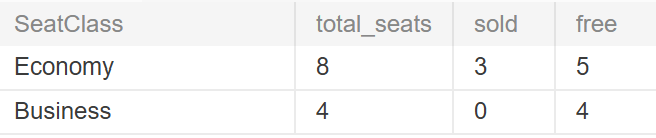 |
| Q2a | 3 | Passenger 1 has three ticketed flight legs across reservations 1 and 8. 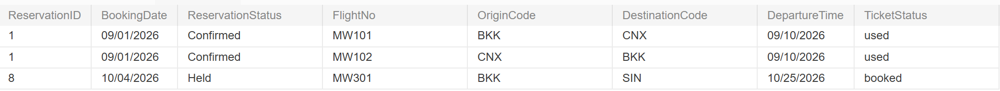 |
| Q2b | 2 | Reservation 1 is paid (3,000.00); reservation 8 is unpaid and held. 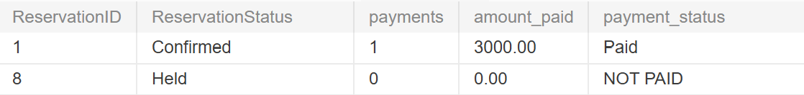 |
| Q3a | 5 | September route income; HKT → USM has no sales and zero income. 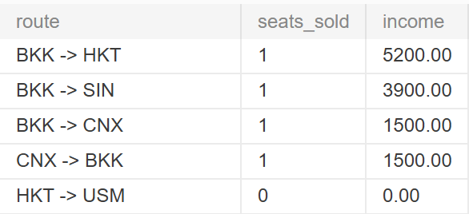 |
| Q3b | 1 | HKT → USM is the only route with the minimum zero seats sold.  |
| Q4 | 5 | Five flights depart in October 2026, ordered by departure time. 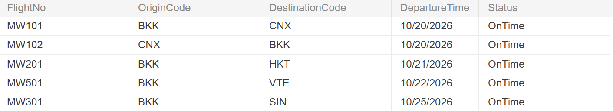 |
| Q5a | 3 | Three passengers match the Saetang family search. 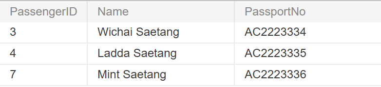 |
| Q5b | 1 | Mint Saetang has no email; the result includes the passenger's phone field. 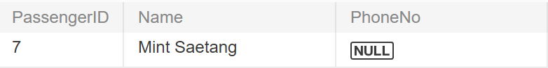 |
| Q6 | 1 | Only Normal meets the `HAVING COUNT(*) >= 3` threshold (4 passengers). 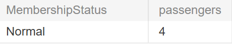 |
| Q7 | 3 | MW101 has three issued passengers in seats 2A–2C. 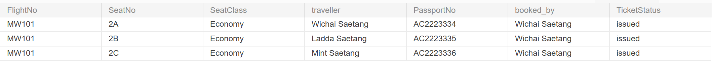 |
| Q8 | 0 | No flight-seat pair has multiple live tickets. 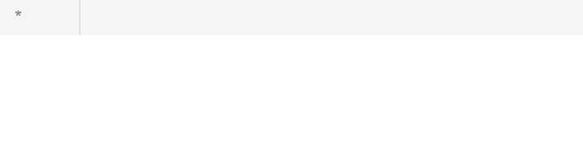 |
| Q8b | 0 | Every staff member has a matching subtype row.  |
| Q9 | 2 | Two booking staff members appear; they created 4 and 3 reservations. 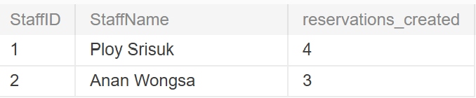 |
| Q19 | 5 | MW101 has five fare-condition rows across Economy and Business fares. 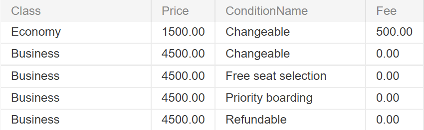 |

**Evidence note:** Q8 and Q8b return zero rows as expected. Their current images
show an empty result area without the column headings, so replace those two
captures with MySQL Workbench screenshots that show the query and the empty
result grid before submitting the final report. Q2a and Q4 are very wide, so
increase Workbench zoom or use a higher-resolution capture to keep their text
readable in the final document. The other images are generated result tables,
not screenshots of the MySQL Workbench window.
